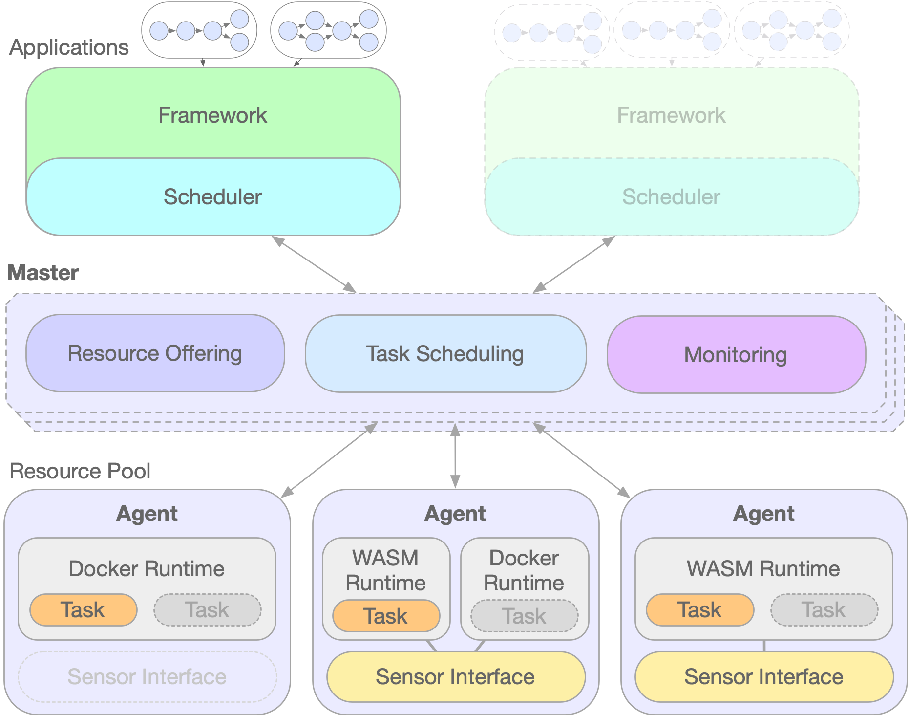

Edge Resource Manager
=====================

Resource managers exist to collect computing resources from multiple disparate machines
and abstract their use into a unified interface for distributed applications. Existing
resources managers are focused on performing this task for cloud-based application.

This is a new resource manager that attempts to break that mold and extend
resource management across networks and computing classes. While the underlying
ideas of resource management are not new (and are heavily based on Apache Mesos), 
the implementation details are. The resource
manager agent is minimal such that it can be run on ultra-small computing devices. Diverse
networking protocols are supported so that one can aggregate resources across
bandwidth constrained networks and behind NATs. We intend to support executors
such as WASM in addition to traditional container environments so that multiple
tasks can be run in memory constrained environments.

## Architecture

The resource manager consists of a master node, multiple agent nodes, 
and frameworks which facilitate the scheduling of applications (which are broken
down into tasks on the) on the agent
nodes. 

    

### Master Node

[The EdgeRM Master](./master/python) node collects resources from agent nodes and offers
those resources to frameworks which can schedule tasks on those resources.
Currently the EdgeRM Master is implemented in python and supports both HTTP
and COAP networking.

If the entire deployment is within a local network, this could be deployed locally,
but we expect it will be most useful if deployed on a publicly accessible server.

### Agent Nodes

EdgeRM agent nodes offer resources on which tasks can be scheduled. They can
range from small embedded nodes up to traditional Linux servers. Agent nodes
support one or mode execution environments (currently Docker and WASM are supported),
and can advertise traditional resources such as compute and memory, and less traditional
resources, such as sensor and actuator devices.

Currently agent nodes are implemented in python supporting a Docker execution
environment and in C on the zephyr OS supporting a WASM execution environment. 

### Resources and Attributes

Resources are anything that needs to be shared are partitioned by tasks
running on an agent node, and attributes are added information about
the nodes on which these resources exist. While the EdgeRM protocol and master do
no enforce the usage of specific resources and attributes, 
without standardization of these types
there would be little portability between frameworks and agent nodes.

A current list of the resources and attributes we use in our agent and framework
implementations are [here](./docs/resource-attributes.md).

## Repo Organization

./master - the EdgeRM master implementation written in python

./agent - multiple EdgeRM agent implementations

./proto - EdgeRM Protobuf definitions

./frameworks - several example frameworks which use EdgeRM

./scheduler - scheduling library and utilities used by the frameworks

./test - full systems tests

./media - media for this project

./docs - more documentation about details of the project

./support - third party supporting directories
